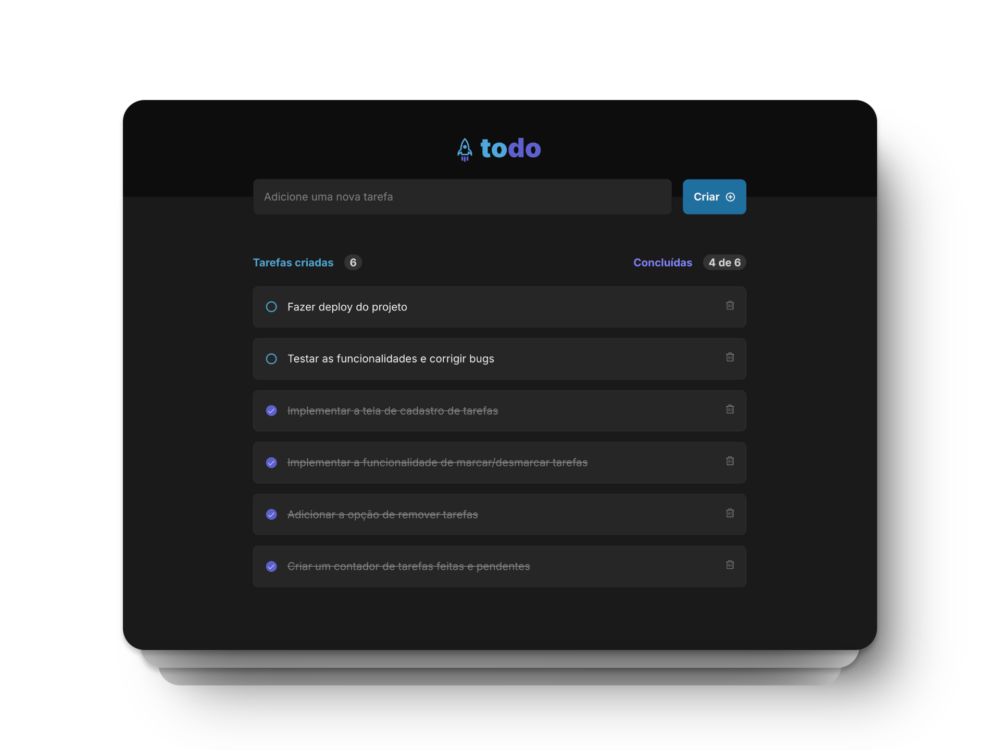

# Today Task

**Today Task** é um aplicativo simples para controle de tarefas diárias, permitindo adicionar, marcar/desmarcar e remover tarefas da lista, além de acompanhar o progresso de conclusão das tarefas.

🔗 <a href="https://todaytask.vercel.app/">Acesse o site</a>

## Tecnologias

<p>
  
  
  
  
</p>



## Bibliotecas
- **Phosphor React** - Para ícones do aplicativo.
- **@hello-pangea/dnd** - Para permitir o arrasto e reorganização das tarefas.
- **React** - Para a construção dos componentes e gerenciamento do estado.
- **React DOM** - Para renderizar o aplicativo no DOM.

## Funcionalidades

- Adicionar tarefas  
- Marcar e desmarcar tarefas como concluídas  
- Remover tarefas  
- Acompanhar o progresso de conclusão das tarefas

## Como usar o projeto
### 1. Clone o repositório
```sh
git clone https://github.com/anaclaraaraujo/today-task
```

### 2. Instale as dependências
```sh
npm install
```

### 3. Execute o projeto localmente
```sh
npm run dev
```

### 4. Acesse o projeto no seu navegador
```sh
http://localhost:5173/
```

## Licença 
[](https://github.com/anaclaraaraujo/todaytask/blob/main/LICENSE)
